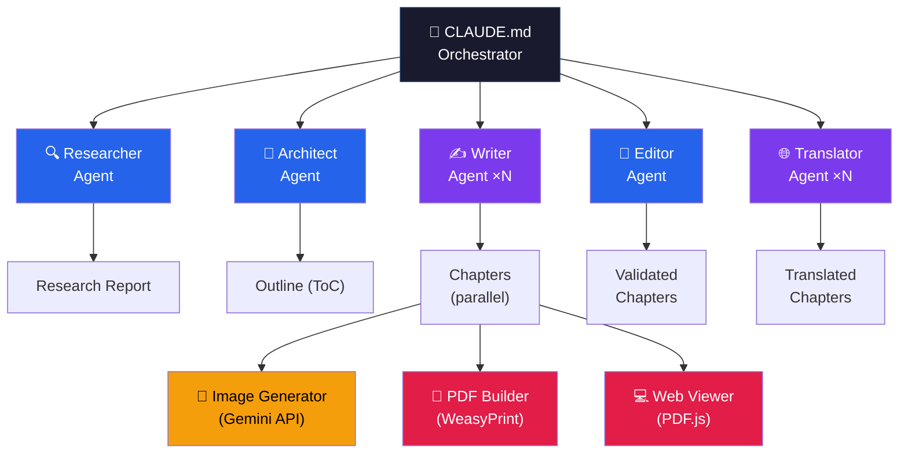

<div align="center">

<br>

<picture>
  <source media="(prefers-color-scheme: dark)" srcset="https://img.shields.io/badge/%F0%9F%93%96_Ebook_Writer_Agent-white?style=for-the-badge&labelColor=1a1a2e&color=0f3460">
  
</picture>

### A multi-agent system that transforms a topic into a professional, print-ready ebook.

**One command. Research, write, edit, illustrate, translate, typeset, publish.**

<br>

[](https://claude.ai/claude-code)
[](https://weasyprint.org/)
[](https://ai.google.dev/)
[](https://mozilla.github.io/pdf.js/)
[](LICENSE)

[**한국어**](README_KO.md) ·
[**Live Demo**](https://lowtidebuild.github.io/ebook-writer/) ·
[**Quick Start**](#-quick-start)

<br>

</div>

---

<br>

## 📖 Live Demo

> **"Claude Code for Lawyers"** — 13 chapters, 250+ pages, fully generated by this agent.

<div align="center">

### [**Read the book online &rarr;**](https://lowtidebuild.github.io/ebook-writer/)

*PDF.js viewer &bull; Two-page spread &bull; Chapter sidebar &bull; KO/EN toggle*

[**Korean PDF**](https://drive.google.com/file/d/1BfSJ9HRZkJq_Qrzl7S9X2nGAHxNncUlc/view?usp=sharing) · [**English PDF**](https://drive.google.com/file/d/1_zzj7sucZNPJC870FPDv0_O0YY1L8OGa/view?usp=sharing)

</div>

<br>

---

<br>

## ✨ What This Does

```
You say:    /generate "Claude Code for Lawyers" --plugin legal --author "Author"

You get:    📄 book.pdf       (250+ page typeset book)
            🌐 web-viewer/    (browser-based reader with page-flip)
            📄 book_en.pdf    (translated version — only if you want it)
```

Language is **auto-detected** from your input. Translation is **optional** — the system asks if you need it.

The pipeline runs automatically with only **two human checkpoints**:

| Gate | When | What Happens |
|:----:|------|-------------|
| **Gate 1** | After outline | Review chapter structure. Approve or request changes. |
| **Gate 2** | After final build | Review PDF + web viewer. Approve or flag specific chapters. |

<br>

---

<br>

## 🏗 Architecture



<br>

### 🧠 Orchestrator — `CLAUDE.md`

The brain of the system:

| Capability | Description |
|:----------:|-------------|
| **State Machine** | `pipeline_state.json` — checkpoint & resume on interruption |
| **Parallel Dispatch** | Writers & translators run as concurrent Tasks per chapter |
| **Dependency Waves** | Independent chapters write in parallel; dependent chapters wait |
| **Quality Gates** | Pauses for human approval at outline and final review |
| **Auto-Retry** | Up to 2 retries per step, then escalation |
| **Plugin Injection** | Detects domain plugins, injects config at relevant steps |

<br>

### 🤖 Sub-Agents (5)

Each agent has a focused role and its own `AGENT.md` instruction file:

| | Agent | What It Does | Execution |
|:--:|-------|-------------|:---------:|
| 🔍 | **Researcher** | Web search + reference analysis &rarr; structured report | Single |
| 📐 | **Architect** | Research &rarr; outline with chapter dependencies | Single |
| ✍️ | **Writer** | Outline section &rarr; full chapter in target language | **Parallel** |
| 🔎 | **Editor** | 2-pass review + production artifact detection | Single |
| 🌐 | **Translator** | Bidirectional KO&harr;EN, preserving code & structure | **Parallel** |

<br>

### ⚡ Skills (7)

Reusable capabilities invoked by agents and the orchestrator:

| | Skill | Purpose | Scripts |
|:--:|-------|---------|:-------:|
| 🌍 | `web-research` | Search strategy, source credibility ranking | — |
| 📄 | `reference-analyzer` | Parse .md / .pdf / .docx files | `parse_references.py` |
| ✅ | `code-example-validator` | Validate code syntax (Python, JS, Bash) | `validate_code.py` |
| 📋 | `quality-checker` | Quality rubric + domain criteria | — |
| 🎨 | `image-generator` | `[IMAGE:]` markers &rarr; Gemini API &rarr; chapters | 3 scripts |
| 📕 | `pdf-builder` | Markdown &rarr; HTML &rarr; WeasyPrint (B5, book-grade) | `build_pdf.py` |
| 💻 | `web-viewer-builder` | PDF.js viewer with sidebar (PyMuPDF TOC extraction) | `build_viewer.py` |

<br>

---

<br>

## 🔄 Pipeline


> **Step 6 (Translate) is optional** — only runs if you request bilingual output
>
> **Gate 1 rejected?** &rarr; Re-run outline only (research preserved)
>
> **Gate 2 rejected?** &rarr; Re-edit only flagged chapters (partial regen)
>
> **Image failed?** &rarr; Non-blocking — placeholder inserted, pipeline continues

<br>

---

<br>

## 📕 PDF Typesetting

The output targets **Korean book publishing standards**:

<table>
<tr><td width="200"><b>Page size</b></td><td>B5 (176 × 250 mm)</td></tr>
<tr><td><b>Margins</b></td><td>Asymmetric — inner 22mm > outer 18mm (binding)</td></tr>
<tr><td><b>Body font</b></td><td>Noto Serif CJK KR · 10pt · line-height 1.75</td></tr>
<tr><td><b>Heading font</b></td><td>Pretendard (sans-serif contrast)</td></tr>
<tr><td><b>Code font</b></td><td>Fira Code · 9pt</td></tr>
<tr><td><b>Chapter openings</b></td><td>Recto page · 30% top space · number + title + rule</td></tr>
<tr><td><b>Running headers</b></td><td>Even: book title (left) · Odd: chapter title (right)</td></tr>
<tr><td><b>Page numbers</b></td><td>Even: bottom-left · Odd: bottom-right</td></tr>
<tr><td><b>TOC</b></td><td>Dot leaders with page numbers</td></tr>
<tr><td><b>Body text</b></td><td>Justified · <code>word-break: keep-all</code> · indent 1em</td></tr>
<tr><td><b>Tables</b></td><td>Horizontal rules only (no vertical borders)</td></tr>
<tr><td><b>Special pages</b></td><td>Cover · title page · copyright page</td></tr>
</table>

<br>

---

<br>

## 🔌 Domain Plugins

Plugins inject **domain-specific expertise** without modifying the core engine:

```
.claude/plugins/legal/
  ├── PLUGIN.md              ← target audience, writing guidelines
  ├── research_sources.md    ← domain-specific research questions
  ├── quality_criteria.md    ← terminology, citation format, disclaimers
  └── references/            ← source materials (.md, .pdf, .docx)
```

The included **`legal`** plugin adds ethics guidelines, legal terminology validation, and citation format checking.

> **Make your own:** Copy `legal/` &rarr; rename &rarr; edit the 3 `.md` files for your domain (medical, finance, engineering, etc.)

<br>

---

<br>

## 🚀 Quick Start

### 1. Clone & setup

```bash
git clone https://github.com/lowtidebuild/ebook-writer.git
cd ebook-writer
./setup.sh
```

> The setup script automatically installs system libraries, fonts, Python venv, and creates a `.env` template.
>
> <details><summary>Manual installation</summary>
>
> ```bash
> # macOS
> brew install pango cairo gdk-pixbuf
> brew install --cask font-noto-serif-cjk-kr font-noto-sans-cjk-kr font-fira-code
>
> # Python
> python3 -m venv .venv && source .venv/bin/activate
> pip install -r requirements.txt
> ```
> </details>

### 2. Set up image generation (optional)

```bash
# Edit .env (created by setup.sh)
GEMINI_API_KEY=your-key-here
```

### 3. Generate

```bash
# Korean book with legal plugin
/generate "Claude Code for Lawyers" --plugin legal --author "Author Name"

# English book, general purpose
/generate "Introduction to Python" --language en --author "Author Name"

# Resume interrupted pipeline
/resume
```

<br>

---

<br>

## 📁 Project Structure

```
.
├── CLAUDE.md                               ← Orchestrator (pipeline state machine)
│
├── .claude/
│   ├── agents/
│   │   ├── researcher/AGENT.md             ← Research conductor
│   │   ├── architect/AGENT.md              ← Outline designer
│   │   ├── writer/AGENT.md                 ← Chapter writer (parallel)
│   │   ├── editor/AGENT.md                 ← Quality reviewer + artifact detector
│   │   └── translator/AGENT.md             ← Bidirectional KO↔EN translator
│   │
│   ├── skills/
│   │   ├── web-research/                   ← Search strategies
│   │   ├── reference-analyzer/             ← .md/.pdf/.docx parser
│   │   ├── code-example-validator/         ← Syntax validation
│   │   ├── quality-checker/                ← Quality rubric
│   │   ├── image-generator/                ← Gemini API pipeline
│   │   ├── pdf-builder/                    ← WeasyPrint book-grade PDF
│   │   └── web-viewer-builder/             ← PDF.js browser viewer
│   │
│   ├── plugins/
│   │   └── legal/                          ← Legal domain plugin (example)
│   │
│   └── commands/
│       ├── generate.md                     ← /generate entry point
│       └── resume.md                       ← /resume entry point
│
├── input/references/                       ← User-provided source materials
├── output/                                 ← Pipeline outputs (gitignored)
├── docs/                                   ← GitHub Pages (live demo)
└── requirements.txt
```

<br>

---

<br>

<div align="center">

**Built with [Claude Code](https://claude.ai/claude-code)**

MIT License

</div>
