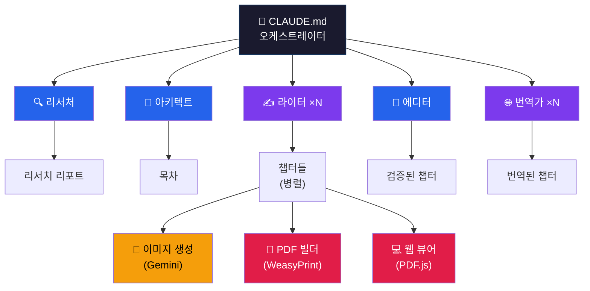

<div align="center">

<br>

<picture>
  <source media="(prefers-color-scheme: dark)" srcset="https://img.shields.io/badge/%F0%9F%93%96_Ebook_Writer_Agent-white?style=for-the-badge&labelColor=1a1a2e&color=0f3460">
  
</picture>

### 주제를 입력하면 전문 수준의 ebook을 자동으로 만들어주는 멀티 에이전트 시스템

**한 줄이면 됩니다. 리서치, 집필, 편집, 이미지, 번역, 조판, 출판까지.**

<br>

[](https://claude.ai/claude-code)
[](https://weasyprint.org/)
[](https://ai.google.dev/)
[](https://mozilla.github.io/pdf.js/)
[](LICENSE)

[**English**](README.md) ·
[**결과물 보기**](https://lowtidebuild.github.io/ebook-writer/) ·
[**빠른 시작**](#-빠른-시작)

<br>

</div>

---

<br>

## 📖 결과물 예시

> **"변호사를 위한 Claude Code 완전 정복"** — 13장, 250+ 페이지, 이 에이전트로 자동 생성.

<div align="center">

### [**온라인으로 읽기 &rarr;**](https://lowtidebuild.github.io/ebook-writer/)

*PDF.js 뷰어 &bull; 2페이지 펼침 &bull; 챕터 사이드바 &bull; 한/영 전환*

[**한국어 PDF 원본**](https://drive.google.com/file/d/1BfSJ9HRZkJq_Qrzl7S9X2nGAHxNncUlc/view?usp=sharing) · [**English PDF**](https://drive.google.com/file/d/1_zzj7sucZNPJC870FPDv0_O0YY1L8OGa/view?usp=sharing)

</div>

<br>

---

<br>

## ✨ 이 시스템이 하는 일

```
입력:    /generate "Claude Code for Lawyers" --plugin legal --author "저자명"

결과:    📄 book.pdf       (250+ 페이지 조판된 도서, 입력 언어로 작성)
         🌐 web-viewer/    (브라우저 기반 책 뷰어)
         📄 book_xx.pdf    (번역본 — 원하는 경우에만)
```

언어는 입력에서 **자동 감지** (한국어 입력 → 한국어 책, 영어 입력 → 영어 책). 번역은 **선택** — 필요한지 물어봅니다.

전체 파이프라인이 자동 실행되며, 사람이 개입하는 건 **딱 두 번**:

| 게이트 | 시점 | 하는 일 |
|:------:|------|---------|
| **Gate 1** | 목차 완성 후 | 챕터 구조 검토. 승인 또는 수정 요청. |
| **Gate 2** | 최종 빌드 후 | PDF + 웹 뷰어 검토. 승인 또는 특정 챕터 지적. |

<br>

---

<br>

## 🛡 v3: Ground Truth Architecture

할루시네이션을 줄이고 결과물 품질을 높이는 빌트인 검증 시스템:

| 기능 | 작동 방식 |
|------|----------|
| **교차 검증** | Researcher가 핵심 주장(통계, 날짜, 법률, API 스펙)을 2+ 독립 소스로 검증. `verification_report.json`에 신뢰도 점수 기록. |
| **인용 추적** | `citations.json` 마스터 DB가 Writer(`[^N]` 각주) &rarr; Editor(검증) &rarr; Translator(보존) &rarr; PDF(참고문헌)로 전달. |
| **코드 실행 검증** | `:runnable` 태그된 코드 블록을 샌드박스에서 실행 (30초 타임아웃). 예상 출력과 실제 출력 비교. |
| **레퍼런스 검증** | `validate_references.py`가 깨진 크로스레퍼런스 탐지 (예: "9장 참조"인데 9장이 없는 경우). |
| **이미지 프롬프트 템플릿** | 6개 유형별 템플릿(architecture, process_flow, comparison, concept, metaphor, generic)으로 수동 프롬프트 작성 대체. |
| **Vision 품질 검증** | 오케스트레이터가 생성된 이미지를 스타일 가이드 대비 평가. 점수 미달 시 재생성. |

<br>

---

<br>

## 🏗 아키텍처

<div align="center">



</div>

<br>

### 🧠 오케스트레이터 — `CLAUDE.md`

| 기능 | 설명 |
|:----:|------|
| **상태 머신** | `pipeline_state.json` — 중단 시 체크포인트/재개 |
| **병렬 디스패치** | Writer와 Translator가 챕터별 동시 실행 |
| **의존성 웨이브** | 독립 챕터 동시 작성, 의존 챕터 순차 대기 |
| **품질 게이트** | 목차/최종 리뷰에서 사람 승인 대기 |
| **자동 재시도** | 단계당 최대 2회, 초과 시 사용자 에스컬레이션 |
| **플러그인 주입** | 도메인 플러그인 감지 후 관련 단계에 설정 주입 |

<br>

### 🤖 서브 에이전트 (5개)

| | 에이전트 | 역할 | 실행 |
|:--:|---------|------|:----:|
| 🔍 | **Researcher** | 웹 검색 + 레퍼런스 분석 + **교차 검증** &rarr; 리포트 + 인용 DB | 단일 |
| 📐 | **Architect** | 리서치 &rarr; 챕터 의존성 포함 목차 설계 | 단일 |
| ✍️ | **Writer** | 목차 섹션 &rarr; **인라인 인용** + `:runnable` 코드 태그 포함 챕터 | **병렬** |
| 🔎 | **Editor** | 2-pass 리뷰 + **자동 레퍼런스/코드 검증** + 잔재 탐지 | 단일 |
| 🌐 | **Translator** | 양방향 KO&harr;EN, 코드/구조/**각주** 보존 | **병렬** |

<br>

### ⚡ 스킬 (7개)

| | 스킬 | 용도 | 스크립트 |
|:--:|------|------|:-------:|
| 🌍 | `web-research` | 검색 전략, 소스 신뢰도 평가 | — |
| 📄 | `reference-analyzer` | .md/.pdf/.docx 파싱 | `parse_references.py` |
| ✅ | `code-example-validator` | 문법 검증 + **`:runnable` 실행** + **크로스레퍼런스 검증** | `validate_code.py` `validate_references.py` |
| 📋 | `quality-checker` | 품질 루브릭 + 도메인 기준 | — |
| 🎨 | `image-generator` | `[IMAGE:]` &rarr; **자동 분류** &rarr; **템플릿 프롬프트** &rarr; Gemini &rarr; **Vision QA** | 4개 스크립트 + 6개 템플릿 |
| 📕 | `pdf-builder` | Markdown &rarr; HTML &rarr; WeasyPrint (B5) + **각주** + **참고문헌** | `build_pdf.py` |
| 💻 | `web-viewer-builder` | PDF.js 뷰어 + PyMuPDF TOC 추출 | `build_viewer.py` |

<br>

---

<br>

## 🔄 파이프라인


> **Step 6 (번역)은 선택** — 양쪽 언어가 필요할 때만 실행
>
> **Gate 1 거부?** &rarr; 목차만 재실행 (리서치 보존)
>
> **Gate 2 거부?** &rarr; 지적된 챕터만 재편집 (부분 재생성)
>
> **이미지 실패?** &rarr; Non-blocking — placeholder 삽입 후 계속

<br>

---

<br>

## 📕 PDF 조판 품질

**한국어 단행본 출판 기준** 적용:

<table>
<tr><td width="180"><b>판형</b></td><td>B5 (176 × 250 mm)</td></tr>
<tr><td><b>여백</b></td><td>비대칭 — 안쪽 22mm > 바깥쪽 18mm (제본용)</td></tr>
<tr><td><b>본문 폰트</b></td><td>Noto Serif CJK KR · 10pt · 행간 1.75</td></tr>
<tr><td><b>제목 폰트</b></td><td>Pretendard (산세리프 대비)</td></tr>
<tr><td><b>코드 폰트</b></td><td>Fira Code · 9pt</td></tr>
<tr><td><b>챕터 시작</b></td><td>오른쪽 페이지 · 30% 상단 공백 · 번호 + 제목 + 장식선</td></tr>
<tr><td><b>러닝 헤더</b></td><td>짝수: 책 제목(좌상) · 홀수: 챕터 제목(우상)</td></tr>
<tr><td><b>페이지 번호</b></td><td>짝수: 좌하 · 홀수: 우하</td></tr>
<tr><td><b>목차</b></td><td>점선 리더 + 페이지 번호</td></tr>
<tr><td><b>본문 정렬</b></td><td>양쪽 정렬 · <code>word-break: keep-all</code> · 들여쓰기 1em</td></tr>
<tr><td><b>테이블</b></td><td>가로선만 (세로선 없음)</td></tr>
<tr><td><b>특수 페이지</b></td><td>표지 · 속표지 · 판권 페이지</td></tr>
</table>

<br>

---

<br>

## 🔌 도메인 플러그인

코어 엔진을 수정하지 않고 **도메인 전문 지식을 주입**합니다:

```
.claude/plugins/legal/
  ├── PLUGIN.md              ← 대상 독자, 작성 가이드라인
  ├── research_sources.md    ← 도메인별 리서치 질문
  ├── quality_criteria.md    ← 용어, 인용 형식, 면책 조항
  └── references/            ← 소스 자료 (.md, .pdf, .docx)
```

포함된 **`legal`** 플러그인은 윤리 가이드라인, 법률 용어 검증, 인용 형식 체크를 추가합니다.

> **직접 만들기:** `legal/` 복사 &rarr; 이름 변경 &rarr; 3개 `.md` 파일을 원하는 도메인(의료, 금융, 공학 등)에 맞게 수정

<br>

---

<br>

## 🚀 빠른 시작

### 1. 클론 & 설치

```bash
git clone https://github.com/lowtidebuild/ebook-writer.git
cd ebook-writer
./setup.sh
```

> 셋업 스크립트가 시스템 라이브러리, 폰트, Python 가상환경, `.env` 템플릿을 자동으로 설치합니다.
>
> <details><summary>수동 설치</summary>
>
> ```bash
> # macOS
> brew install pango cairo gdk-pixbuf
> brew install --cask font-noto-serif-cjk-kr font-noto-sans-cjk-kr font-fira-code
>
> # Python
> python3 -m venv .venv && source .venv/bin/activate
> pip install -r requirements.txt
> ```
> </details>

### 2. 이미지 생성 설정 (선택)

```bash
# .env 파일 편집 (setup.sh가 자동 생성)
GEMINI_API_KEY=your-key-here
```

### 3. 실행

```bash
# 한국어 + 법률 플러그인
/generate "Claude Code for Lawyers" --plugin legal --author "저자명"

# 영어, 범용 모드
/generate "Introduction to Python" --language en --author "Author Name"

# 중단된 파이프라인 재개
/resume
```

<br>

---

<br>

## 📁 프로젝트 구조

```
.
├── CLAUDE.md                               ← 오케스트레이터 (상태 머신)
│
├── .claude/
│   ├── agents/
│   │   ├── researcher/AGENT.md             ← 리서치 에이전트
│   │   ├── architect/AGENT.md              ← 목차 설계 에이전트
│   │   ├── writer/AGENT.md                 ← 챕터 작성 (병렬)
│   │   ├── editor/AGENT.md                 ← 품질 검증 + 잔재 탐지
│   │   └── translator/AGENT.md             ← 양방향 KO↔EN 번역
│   │
│   ├── skills/
│   │   ├── web-research/                   ← 검색 전략
│   │   ├── reference-analyzer/             ← .md/.pdf/.docx 파서
│   │   ├── code-example-validator/         ← 문법 검증
│   │   ├── quality-checker/                ← 품질 루브릭
│   │   ├── image-generator/                ← Gemini API 파이프라인
│   │   ├── pdf-builder/                    ← WeasyPrint 단행본 PDF
│   │   └── web-viewer-builder/             ← PDF.js 브라우저 뷰어
│   │
│   ├── plugins/legal/                      ← 법률 도메인 플러그인
│   └── commands/                           ← /generate, /resume
│
├── input/references/                       ← 사용자 소스 자료
├── output/                                 ← 산출물 (gitignored)
├── docs/                                   ← GitHub Pages (라이브 데모)
└── requirements.txt
```

<br>

---

<br>

<div align="center">

**Built with [Claude Code](https://claude.ai/claude-code)**

Apache License 2.0

</div>
